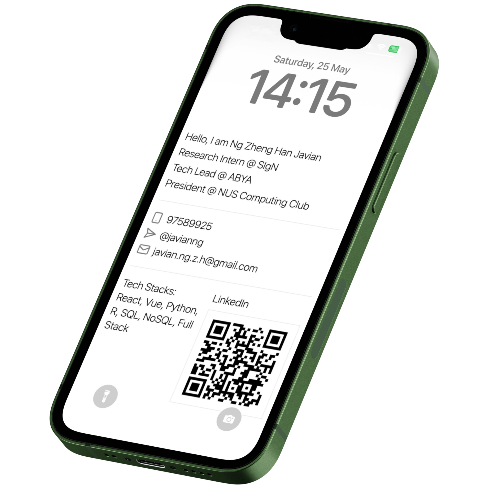

# Networking Lock Screen Generator

Unlock your networking potential by creating custom lock screens for networking events that showcase your professional details. This application allows you to generate professional-looking lock screens with QR codes, making it easy to share your contact information instantly.

## Features

- **Customizable Lock Screens**: Add your professional details including name, phone number, email, job title, company, and additional information.
- **QR Codes**: Generate one or two QR codes for easy sharing of your LinkedIn, GitHub, or any other URLs.
- **Company Image**: Optionally upload a company image to be used as a background.
- **Responsive Design**: The application is designed to be used on various devices.
- **100% Free**: No cost involved in using this tool.
- **Instant Generation**: Create your lock screen in seconds.
- **Easy to Use**: Simple and intuitive interface.

## Technologies Used

- **React**: JavaScript library for building user interfaces.
- **TypeScript**: Typed superset of JavaScript that compiles to plain JavaScript.
- **Next.js**: React framework for server-side rendering and static site generation.
- **Tailwind CSS**: Utility-first CSS framework for rapid UI development.
- **html-to-image**: Library for converting HTML into images.
- **lucide-react**: Icon library for React.

## Getting Started

### Prerequisites

- **Node.js**: Ensure you have Node.js installed on your machine. You can download it from [Node.js](https://nodejs.org/).

### Installation

1. **Clone the repository**:

   ```bash
   git clone https://github.com/javianng/networking-lock-screen-generator.git
   cd networking-lock-screen-generator
   ```

2. **Install dependencies**:

   ```bash
   npm install
   ```

### Running the Application

1. **Start the development server**:

   ```bash
   npm run dev
   ```

2. **Open your browser** and navigate to `http://localhost:3000` to view the application.

## Usage

1. **Select QR Code Count**: Choose between one or two QR codes.
2. **Enter Your Details**: Fill in your professional information including name, phone number, email, job title, company, and any additional info.
3. **Upload Company Image (Optional)**: Add a background image representing your company.
4. **Generate Wallpaper**: Click the "Generate Wallpaper" button to create your custom lock screen.
5. **Download**: The generated lock screen can be downloaded as an image file.

## Example

Here is an example of how the lock screen looks:



## Contributing

We welcome contributions! Please follow these steps to contribute:

1. **Fork the repository**.
2. **Create a new branch** for your feature or bug fix.
3. **Commit your changes**.
4. **Push your branch** to your forked repository.
5. **Open a pull request** with a detailed description of your changes.

## License

This project is licensed under the MIT License. See the [LICENSE](LICENSE) file for more details.

## Acknowledgements

- **React**: A JavaScript library for building user interfaces.
- **TypeScript**: A superset of JavaScript that compiles to plain JavaScript.
- **Next.js**: A React framework for server-side rendering and static site generation.
- **Tailwind CSS**: A utility-first CSS framework.
- **html-to-image**: A library for converting HTML to images.
- **lucide-react**: An icon library for React.

## Contact

If you have any questions or suggestions, feel free to open an issue or reach out to me on [LinkedIn](https://www.linkedin.com/in/javianngzh/).

---

Made with ❤️ by Javian Ng
